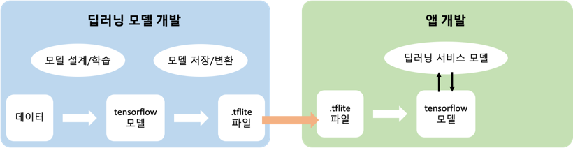

# 1장. 안드로이드와 텐서플로 라이트 입문

## 1.1 Workflow

- 교재에 그려진 개발 프로세스 그림이 잘 표현된 것 같아 비슷하게 그려봄.
- 핵심은 딥러닝 모델 개발 프로세스와 앱 개발 프로세스가 병행이 가능하다는 점이다.
- 확인 결과 iOS/Android 모두 동일하게 적용될 수 있었다.

## 1.2 Android on-device AI

- 서버 기반의 아키텍처에서는 서버에 딥러닝 모델에 대한 Req/Res 통신이 이었지만, 이제는 모바일 디바이스에서 IoT에 특화된 딥러닝 프레임워크인 Tensorflow Lite를 통해 자체 딥러닝 모델을 탑재할
  수 있게 되었다.

## 1.3 Android 환경 구축

- 설치는 알아서

## 1.4 Tensorflow Lite 입문

### 1.4.1 개요

- 딥러닝 모델의 학습 및 추론에는 컴퓨팅 자원이 많이 필요한데, 모바일이나 임베디드 기기는 가용한 컴퓨팅 자원이 제한적이므로 텐서플로 라이트는 모델 경량화에 중점을 둔다.

### 1.4.2 구성과 특징

#### (1) 구성

- Converter(컨버터), Interpreter(인터프리터)로 구성
- 컨버터: 텐서플로 모델을 텐서플로 라이트 모델로 변환
- 인터프리터: 텐서플로 라이트 모델을 모바일에서 활용할 수 있게 해준다.

#### (2) 특징

- 자원이 제한되어 있어서 효율성에 초점을 두고 있다.
- 모델의 크기를 줄여서 사용한다.
- Android에서는 GPU 가속 외에 NNAPI(Neural Networks API) 위임을 지원하여 추가적으로 성능 향상이 가능하다.
- 양자와 기술을 통해 더욱 최적화된 모델을 만드는데 도움이 된다.

### 1.4.3 텐서플로와 텐서플로 라이트 비교

| 구분    | 텐서플로 | 텐서플로 라이트        |
|-------|------|-----------------|
| 개발 언어 | 파이썬  | 파이썬+Java/Kotlin |
|역할|딥러닝 모델 개발|딥러닝 모델 변환, 실행|
|연산자|텐서플로의 모든 연산자|텐서플로 일부 연산자(추가 가능)|

### 1.4.4 기술적 제약

#### (1) 연산자 제약
- 추론 모델에서 널리 사용되는 일부 연산자만 지원한다.
  - 텐서플로에서 텐서플로 라이트에서 지원하지 않는 연산자 사용하면 모델 변환 불가
  - 심지어 지원하는 연산자여도 성능 문제로 인해 특정 패턴만 사용하도록 제한하기도 함

#### (2) 학습 제약
- 기기 내 추론만 가능
- 기기 내 학습도 지원 시작했음
  - https://www.tensorflow.org/lite/examples/on_device_training/overview
- 온라인 학습을 적용하기 어렵고 정적 학습만 가능함.
  - 주어진 데이터를 이용해 학습을 완료하면 학습된 상태가 변하지 않고 유지됨.
  - 온라인 학습은 모델이 배포된 이후에도 추가적인 데이터를 이용해 추가 학습이 가능함.
- **새로운 데이터가 지속적으로 발생하는 모바일 환경은 온라인 학습이 더 적합하다.**

### 1.5 텐서플로 라이트 개발 환경 구축
- 알아서
- 구글 코랩을 이용해 클라우드 환경에서 텐서플로를 이용하는 방법도 있음
- 12시간 무료 세션 제공함
    - 유료는 월 9.99달러

